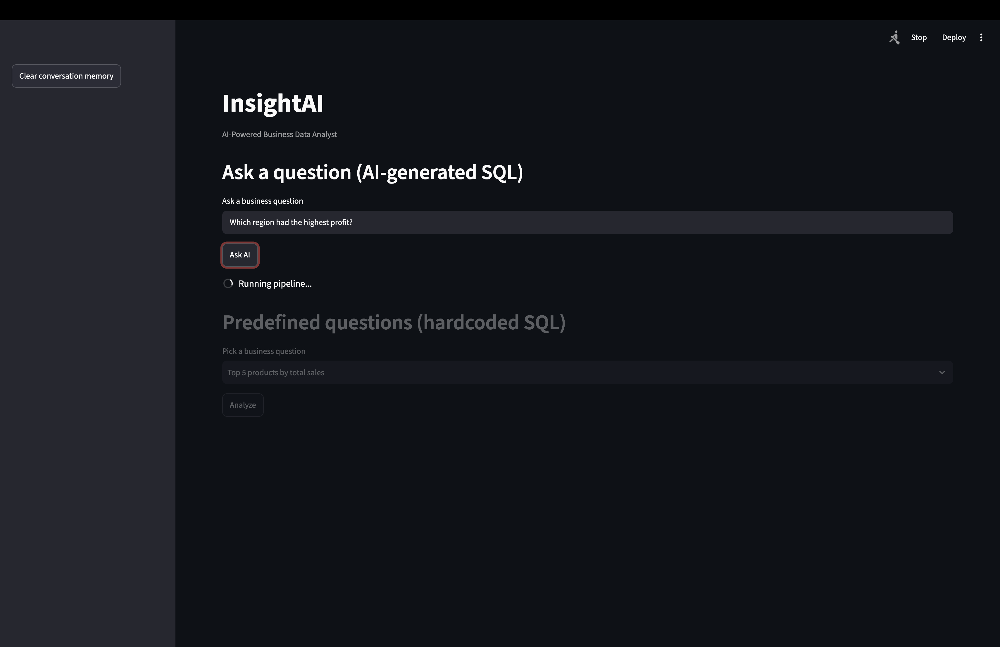
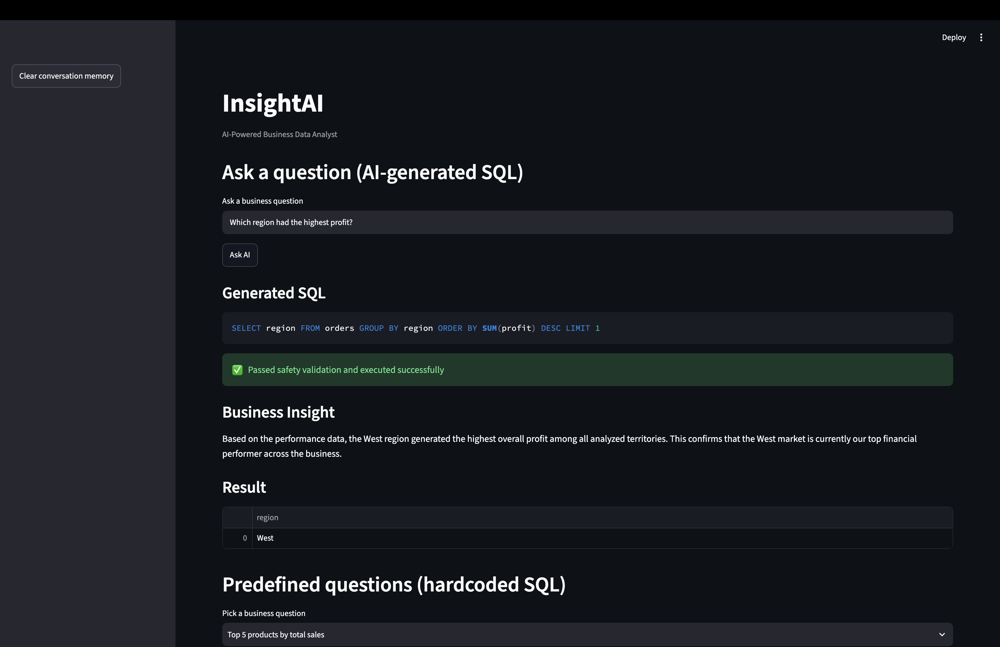
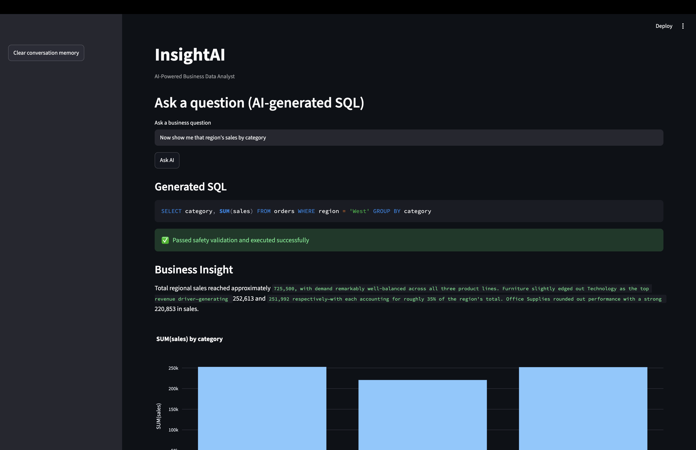
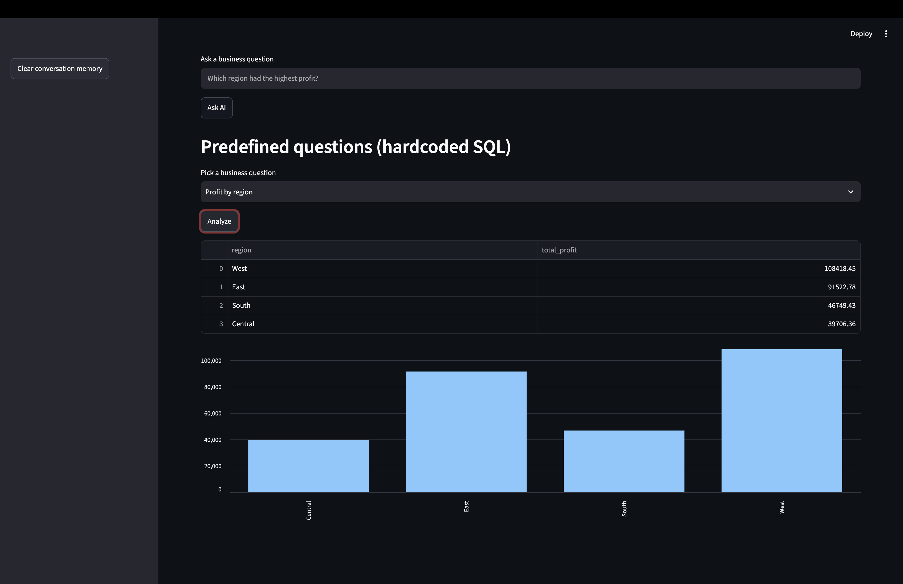
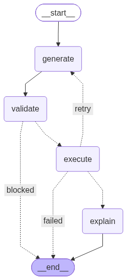

# InsightAI — AI-Powered Business Data Analyst

Ask business questions in plain English. InsightAI converts them into
validated SQL, runs them against a real sales dataset, and returns results
as a chart, table, and plain-English business explanation. Built as a
LangGraph state machine with persistent conversation memory, so follow-up
questions like "now break that down by category" resolve correctly.

## Example
> "Which region had the highest profit?" → West
> "Now show me that region's sales by category" → correctly resolves "that region" to West using conversation history

## Screenshots

**Asking a question — pipeline running:**


**First question answered — SQL generated, safety validation passed, correct result:**


**Follow-up question using conversation memory — "that region" correctly resolved to West without restating it:**


**Predefined hardcoded questions, shown for comparison against AI-generated SQL:**


## Architecture



Question → Generate SQL (Gemini) → Validate → Execute
↑ (retry on failure) ↓
└──────────────────────── Explain → Save Memory → Response


Orchestrated as an explicit LangGraph state graph — not a linear script —
with conditional routing for safety checks and error-correction, plus a
persisted SQLite conversation history for reference resolution across turns.

## Features
- Natural language to SQL (Google Gemini)
- Schema auto-extracted directly from the database (no hardcoded prompts)
- SQL safety validation — blocks destructive queries before execution
- Self-correction loop — automatically retries and fixes failed SQL using
  the error message
- Auto-generated charts based on result shape (bar/line/table)
- AI-generated plain-English business explanations
- Orchestrated via LangGraph (explicit state machine, not a manual loop)
- Persistent conversation memory (SQLite-backed) — supports follow-up
  questions referencing prior turns, e.g. "that region," "now break it down by X"
- Graceful handling of real API failure modes: exponential backoff for
  transient provider outages (503), immediate clean failure for daily
  quota limits (429) — distinguished because retrying helps one and not
  the other

## Tech Stack
Python, Streamlit, SQLite, LangGraph, Google Gemini (`google-genai`), pandas,
Plotly, `uv`

## Dataset
[Superstore Sales Dataset](https://www.kaggle.com/datasets/vivek468/superstore-dataset-final) (Kaggle) — 9,994 orders across 4 regions

## Known Limitations
- Single shared conversation history — no per-user isolation, since there's
  no authentication system. A multi-user version would add a session/user
  ID column to the memory table.
- SQL validation is string/AST-based rather than a full parser (e.g.
  `sqlglot`) — sufficient to block destructive statements but not
  exhaustive against every possible SQL edge case.
- Free-tier Gemini quota (20 requests/day) limits sustained testing/demo use.

## Run it locally
```bash
git clone https://github.com/varana2001/insight-ai-.git
cd insight-ai-
uv venv
source .venv/bin/activate
uv pip install -r requirements.txt
cp .env.example .env   # add your own GEMINI_API_KEY
python -m streamlit run app.py
```